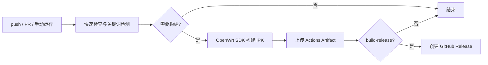

# 🏗️ CI 构建与发布

GitHub Actions 工作流位于 `.github/workflows/ci.yml`，负责静态检查、测试、OpenWrt IPK 构建和 GitHub Release。

## 🎯 触发规则

| 事件或提交关键词 | 快速检查 | 构建 IPK | 创建 Release |
| --- | :---: | :---: | :---: |
| 普通 `main` 推送 | 是 | 否 | 否 |
| Pull Request 到 `main` | 是 | 是 | 否 |
| 手动运行 `workflow_dispatch` | 是 | 是 | 否 |
| 提交信息包含 `[build-action]` | 是 | 是 | 否 |
| 提交信息包含 `[build-release]` | 是 | 是 | 是 |

关键词不区分大小写，但必须保留方括号。若同一提交同时包含两个关键词，`[build-release]` 优先。

## 💬 提交示例

```bash
# 只运行检查，不下载 SDK
git commit -m "docs(ci): 更新构建说明"

# 检查并构建 IPK，产物保存在 Actions Artifacts
git commit -m "ci(actions): 验证 OpenWrt 软件包 [build-action]"

# 检查、构建 IPK，并创建 GitHub Release
git commit -m "release(package): 发布新版本 [build-release]"
```

发布前必须在 `Makefile` 中更新 `PKG_VERSION` 或 `PKG_RELEASE`。Release 标签由两者组合生成，例如 `v0.1.0-r1`。相同标签已存在时，工作流会失败，不会覆盖已有 Release。

## 🔄 流水线



快速检查包括 JavaScript 语法、JSON 解析、Node.js 测试，以及 `scripts` 和 `tests` 下的 Python 编译检查。

IPK 当前使用 OpenWrt 23.05.4 的 `ramips/mt7621` SDK 构建；软件包架构为 `all`，因为插件本身不包含平台相关二进制。

Actions Artifact 同时包含主包 `luci-app-live-traffic` 和简体中文语言包 `luci-i18n-live-traffic-zh-cn`，安装时应同时安装两者。
