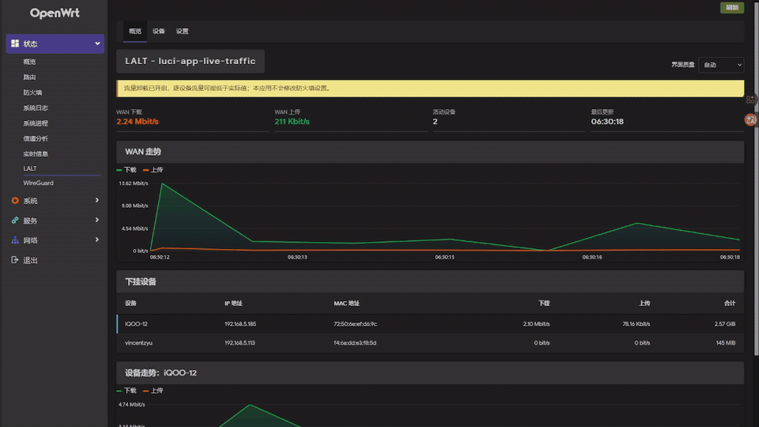
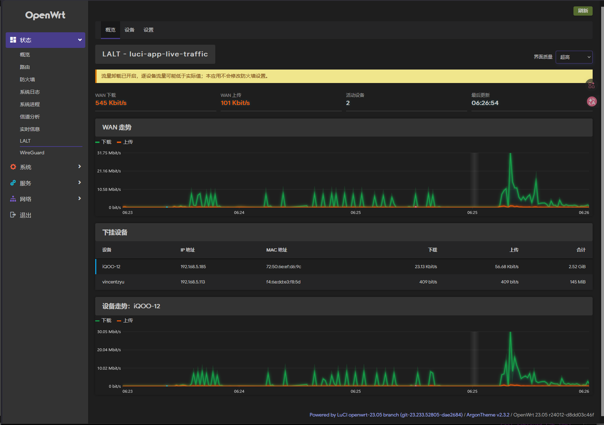
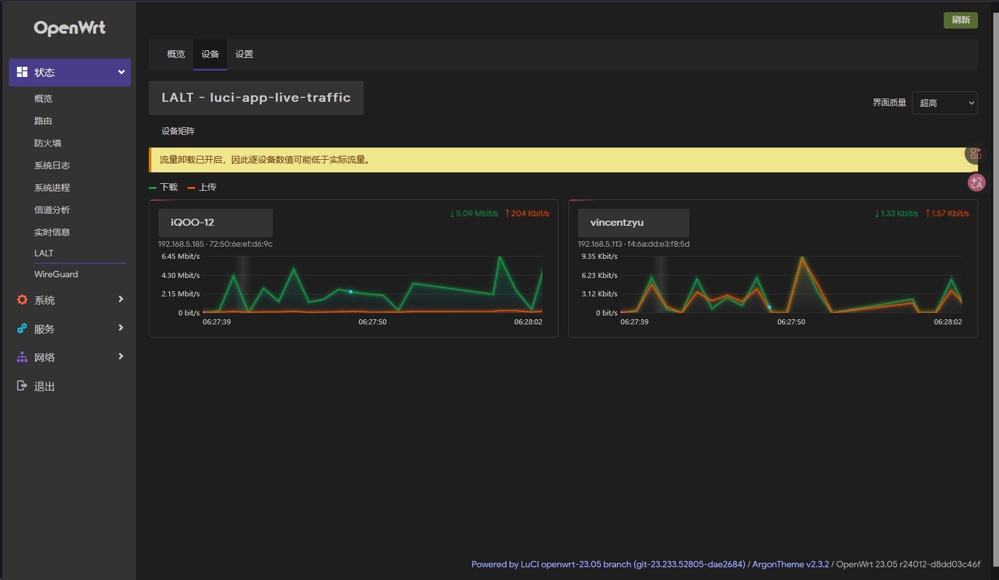
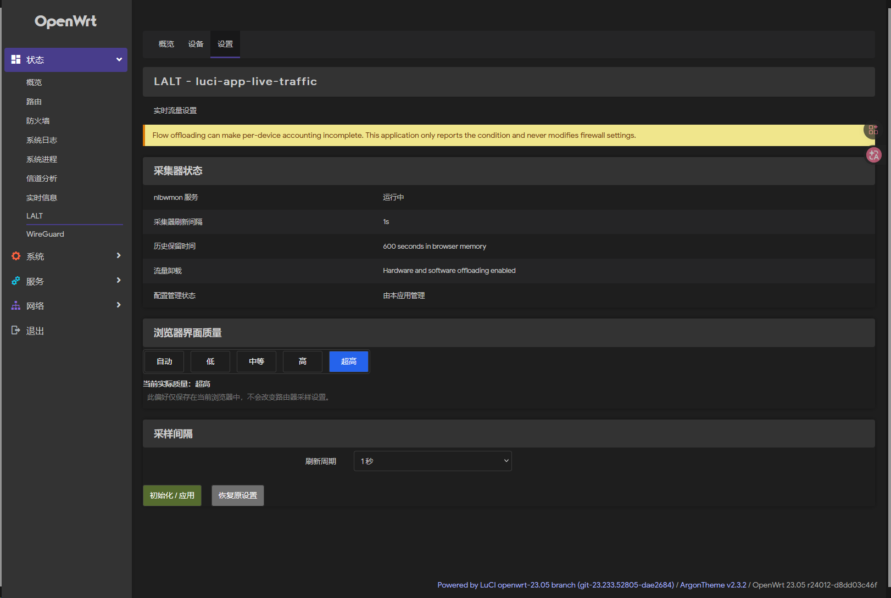
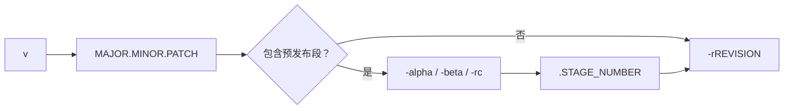
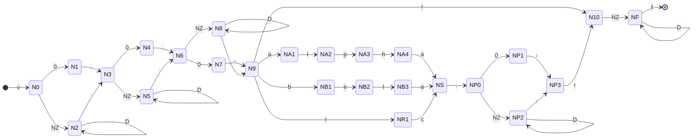
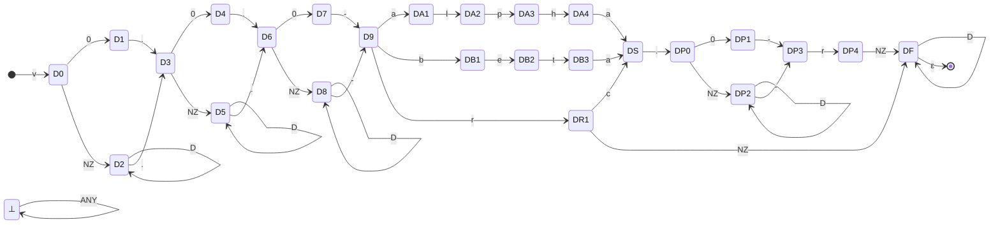

# 📊 LALT - luci-app-live-traffic

LALT（`luci-app-live-traffic`）是面向 OpenWrt 的轻量实时流量监控 LuCI 应用，按下挂设备展示上传、下载和最近 10 分钟走势。

## ✨ 功能

- WAN 实时上传、下载曲线。
- 按 MAC 聚合下挂客户端的实时速率与累计流量。
- 总览、设备矩阵和设置三个 LuCI 页面。
- 1、2、5、10 秒刷新间隔，默认 1 秒。
- 自动、低、中、高和超高五档浏览器 UI 质量，支持平滑曲线、数字补间与动态视觉效果。
- 历史仅保存在浏览器内存，不持续写入闪存。
- 检测 Flow Offloading 并警告，不修改防火墙配置。

## 🖼️ 界面预览

**动态演示**



**实时流量总览**



**设备矩阵**



**设置**



## 🧪 开发测试环境

| 项目 | 已测试配置 |
| --- | --- |
| OpenWrt | `23.05.4` |
| Linux 内核 | `5.15.162` |
| 包管理器 | `opkg` |
| 路由器 | Xiaomi Mi Router 3G（小米路由器 R3G） |
| CPU | MediaTek MT7621，四线程，主频 `880 MHz` |
| CPU 架构 | MIPS 1004Kc Little-Endian，对应 OpenWrt `ramips/mt7621` |
| 内存 | 约 `244 MiB` |
| 依赖 | `nlbwmon`、`rpcd-mod-ucode` |

> **测试设备 Fastfetch 信息**
>
> 

硬件或软件 Flow Offloading 会使部分流量绕过 conntrack，因此逐设备统计可能低于实际值。

## 🏷️ 版本规范

Release 标签采用 `v0.2.3-beta.4-r1` 格式：`v` 是 Git 标签前缀，`0.2.3` 是应用语义版本，`beta.4` 是可选的预发布阶段与序号，`r1` 是对 OpenWrt `PKG_RELEASE=1` 的人类可读标记。`r` 不是 Release Candidate、Git revision 或 R3G 型号；CI 会按 `v${PKG_VERSION}-r${PKG_RELEASE}` 组合标签。

### 🔍 正则表达式

以下正则表达式用于完整校验 Release 标签：

```regex
^v(0|[1-9]\d*)\.(0|[1-9]\d*)\.(0|[1-9]\d*)(?:-(alpha|beta|rc)\.(0|[1-9]\d*))?-r([1-9]\d*)$
```

### 🧱 扩展巴科斯范式

以下扩展巴科斯范式（EBNF）描述与正则表达式相同的版本语言：

```ebnf
version          = "v", semantic-version, [ prerelease ], "-r", revision ;
semantic-version = number, ".", number, ".", number ;
prerelease       = "-", stage, ".", number ;
stage            = "alpha" | "beta" | "rc" ;
number           = "0" | nonzero-digit, { digit } ;
revision         = nonzero-digit, { digit } ;
digit            = "0" | nonzero-digit ;
nonzero-digit    = "1" | "2" | "3" | "4" | "5" | "6" | "7" | "8" | "9" ;
```

### 🧭 结构流程



字符类图例：`NZ=[1-9]`、`D=[0-9]`、`ε` 表示不消耗输入。以下自动机逐字符展开，已不再把数字或阶段名称视为单个词法单元。

<details>
<summary>🔀 展开完整逐字符 NFA</summary>



</details>

<details>
<summary>➡️ 展开完整逐字符 DFA</summary>



</details>

NFA 在没有可用转移时拒绝输入；DFA 中所有未画出的转移均进入 `⊥`，因此它对整个字符集都有唯一转移。

OpenWrt 通用打包规则会把 `PKG_VERSION=0.2.3-beta.4` 与 `PKG_RELEASE=1` 组合为包版本 `0.2.3-beta.4-1`；标签中的 `r` 只是为了清楚区分打包修订号。OpenWrt 23.05 的 `luci.mk` 是例外，它会把 LuCI 主包版本覆盖为仅 `PKG_VERSION`，因此当前 IPK 的 control 字段是 `Version: 0.2.3-beta.4`。

- 源码功能或行为变化时递增 `PKG_VERSION`，并将 `PKG_RELEASE` 重置为 `1`。
- 通用 OpenWrt 包仅调整依赖、安装逻辑、补丁或打包元数据时递增 `PKG_RELEASE`；本项目修正 LuCI 打包规则前不得发布仅递增 `r` 的升级包，否则 opkg 无法识别出更高版本。

## 🚀 开发部署

确保 SSH 公钥登录可用，然后执行：

```powershell
python scripts/deploy.py deploy --host 192.168.1.1 --identity $env:USERPROFILE\.ssh\id_ed25519
```

路由器需要通过 `proxychains4` 下载软件包时增加 `--proxychains`。命令仅调用路由器已有配置，不包含代理地址。

部署前预览命令：

```powershell
python scripts/deploy.py deploy --host 192.168.1.1 --dry-run
```

卸载开发版本并恢复插件管理的 `nlbwmon` 刷新间隔：

```powershell
python scripts/deploy.py uninstall --host 192.168.1.1
```

## ⚙️ 安装后

进入 **状态 -> LALT -> 设置**，确认初始化后，插件会备份 `nlbwmon` 原刷新间隔并调整为选择的采样间隔。

流量数据范围仅包括经过本 OpenWrt 路由器转发的下挂客户端。它无法监控上游主路由的其他平级设备。

UI 质量偏好仅保存在当前浏览器中。图表和动画由客户端浏览器渲染，不会改变 `nlbwmon` 采样频率；自动档会保守选择低或中档，并在检测到持续慢帧时降级。

## 🧪 测试

```bash
node --test tests/core.test.mjs
node --check htdocs/luci-static/resources/live-traffic/core.js
```

真实路由器 WebUI 验收脚本使用 Python Playwright。配置优先级为：CLI 参数 > 当前进程环境变量 > `tests/webui/.env` > 内置默认值。先根据 `.env.example` 创建私有 `.env`，再创建虚拟环境并安装依赖：

```bash
uv venv .venv
uv pip install --python .venv -r tests/webui/requirements.txt
```

激活虚拟环境后，以下是 5 个常用示例：

```bash
# 默认检查 5 档质量、3 个页面和桌面/移动端，共生成 30 张截图
python tests/webui/webui_e2e.py
# 有头慢速运行，并在结束前保留浏览器 5 秒
python tests/webui/webui_e2e.py --headed --slow-mo-ms 250 --hold-seconds 5
# 仅检查总览页
python tests/webui/webui_e2e.py --url https://192.168.5.1 --page overview
# 仅检查桌面端超高质量模式
python tests/webui/webui_e2e.py --quality ultra --viewport desktop
# 从独立私密文件读取密码
python tests/webui/webui_e2e.py --password-file path/to/password.txt
```

截图和脱敏报告输出到被 Git 忽略的 `tmp/browser-debug/`；截图仍可能包含 IP、MAC 和设备名，请勿公开上传。

CI 的提交关键词、IPK 构建和 GitHub Release 规则见 [ci.md](.github/workflows/ci.md)。

## 📄 许可证

[Apache-2.0](LICENSE)
