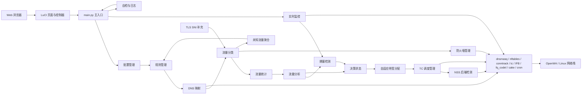

# luci-app-sqm-controller

`luci-app-sqm-controller` 是一个面向 OpenWrt 的 SQM 控制器与 LuCI 管理界面项目。  
核心目标是把**流量分类、拥塞检测、策略判断、带宽分配和队列下发**组织成一条可观测、可调试、可回滚的业务链路。

它不是官方 `sqm-scripts` 的皮肤封装，而是一套独立实现的控制器，适合：

- 在 OpenWrt 上做业务分类与低时延控制
- 在 x86 软路由或性能余量较高的设备上部署
- 二次开发 LuCI 页面、Python 后端和策略逻辑

## 项目概览

4.0 版本已经从“单点限速工具”演进为一套模块化系统，主要包含：

- LuCI 前端页面与控制器
- Python 后端主入口与模块化业务链
- `nftables + conntrack + tc` 分类与调度链路
- 软件 HTB 多类队列与可选的 IPQ807x NSS 硬件队列后端
- DNS 映射、TLS SNI 补充识别、未知流量聚合
- dry-run 策略评估与手动 apply 下发分离机制
- 自检、监控、日志轮转、导出与恢复能力
- 每分钟后台监控采样、JSONL 持久化和 24 小时历史查看

## 主要能力

### 1. 队列与整形

- 支持 `fq_codel` 与 `cake`
- 支持上行 / 下行独立带宽设置
- 基于 `HTB + IFB` 统一控制上下行队列
- 基于 `tc class` 与 `fwmark` 进行分类调度
- 队列后端支持 `auto / software / nss`
- 可选通过 `sqm-scripts-nss` 使用 IPQ807x NSS 硬件整形

软件模式支持完整流量分类和策略中心。NSS 模式仅提供基础带宽整形与监控，不支持当前软件多类分类链路；x86 应使用自动检测或软件模式。

### 2. 流量分类

- 端口 / 协议 / 连接特征分类
- DNS 域名到业务类别的映射分类
- `conntrack` 兜底诊断
- TLS SNI 补充识别
- 未知流量聚合与规则补充辅助

### 3. 策略与分配

- 拥塞检测：RTT、丢包、抖动、实时带宽
- 决策状态机：冷却时间与防抖命中计数
- 自适应带宽分配：保障、上限、保守模式
- 策略评估与策略下发分离：
  - `--policy-once`：定时 dry-run，只评估不改队列
  - `--policy-apply`：快照、下发、失败回滚

### 4. 运维与可视化

- 配置向导、基础设置、状态监控、实时监控
- 分类流量统计、DNS 规则管理、策略中心
- 自检、日志查看、日志轮转、配置备份与恢复
- 日志关键字/级别筛选和紧凑自检工作台
- 监控历史持久化至 `/etc/sqm_controller/monitor_history.jsonl`
- AI 辅助 DNS 规则导出 / 导入闭环

## 系统架构



## 仓库结构

```text
luci-app-sqm-controller/
├── Makefile
├── README.md
├── description.txt
├── check-deps.sh
├── files/
│   ├── etc/
│   │   ├── config/sqm_controller
│   │   └── init.d/sqm-controller
│   ├── share/rpcd/acl.d/luci-app-sqm-controller.json
│   └── usr/
│       ├── bin/
│       │   ├── sqm-start.sh
│       │   ├── sqm-status.sh
│       │   └── sqm-stop.sh
│       └── lib/sqm-controller/
│           ├── main.py
│           ├── config_manager.py
│           ├── rule_manager.py
│           ├── dns_mapper.py
│           ├── tls_sni.py
│           ├── traffic_classifier.py
│           ├── traffic_stats.py
│           ├── traffic_analyzer.py
│           ├── unknown_flow_logger.py
│           ├── congestion_detector.py
│           ├── decision_state.py
│           ├── adaptive_allocator.py
│           ├── firewall_manager.py
│           ├── tc_manager.py
│           ├── nss_detect.py
│           ├── monitor.py
│           ├── self_check.py
│           ├── speedtest.py
│           └── policy_engine.py
└── luasrc/
    ├── controller/sqm_controller.lua
    ├── model/cbi/sqm_controller.lua
    └── view/sqm_controller/
        ├── wizard.htm
        ├── settings_style.htm
        ├── status.htm
        ├── monitor.htm
        ├── traffic.htm
        ├── policy.htm
        ├── logs.htm
        └── help.htm
```

## 核心模块说明

| 模块 | 作用 |
| --- | --- |
| `main.py` | 主入口，负责 LuCI / CLI 调用、策略链组织、日志输出、下发回滚 |
| `config_manager.py` | 读取与校验 UCI 配置 |
| `rule_manager.py` | 端口分类规则管理 |
| `dns_mapper.py` | DNS 日志解析、域名规则匹配、用户 DNS 规则、AI 规则导入 |
| `tls_sni.py` | TLS ClientHello 中的 SNI 补充识别 |
| `traffic_classifier.py` | 分类规则下发、`conntrack` 扫描、动态诊断 |
| `traffic_stats.py` | `tc class` 原始统计采集 |
| `traffic_analyzer.py` | 业务占比分析、未知流量估算 |
| `unknown_flow_logger.py` | 未识别流量聚合与导出 |
| `congestion_detector.py` | 基于 RTT / 丢包 / 抖动的拥塞分级 |
| `decision_state.py` | 决策状态机、防抖与冷却 |
| `adaptive_allocator.py` | 按业务类别生成带宽分配方案 |
| `firewall_manager.py` | `nftables` / 标记规则下发 |
| `tc_manager.py` | HTB / IFB / qdisc / class 管理 |
| `nss_detect.py` | IPQ807x、NSS 模块、sqm-scripts-nss 与实际队列后端检测 |
| `monitor.py` | 实时监控采样、JSONL 持久化和历史窗口读取 |
| `self_check.py` | 运行环境与配置自检 |
| `speedtest.py` | 基础测速 |
| `policy_engine.py` | 旧策略入口兼容包装器，实际转发到 `main.py --policy-once` |

## 页面与接口

LuCI 菜单入口位于：

- `服务 -> SQM流量控制`

主要页面包括：

- `基础设置`
- `配置向导`
- `状态监控`
- `实时监控`
- `分类流量统计`
- `策略中心`
- `系统日志`
- `帮助文档`

Lua 控制器为：

- `luasrc/controller/sqm_controller.lua`

该控制器同时暴露了多个 JSON 接口，例如：

- 状态：`get_status`
- 监控：`get_monitor` / `get_monitor_history`
- 分类：`get_class_stats` / `get_classifier_state`
- 策略：`policy_once` / `get_policy_status` / `get_policy_log`
- DNS 规则：`list_dns_rules` / `save_dns_user_rules`
- AI 规则闭环：`export_unmatched_dns` / `import_ai_dns_rules`

## 运行方式

### 服务启动

初始化脚本：

- `/etc/init.d/sqm-controller`

特点：

- 不注册常驻 `procd` 实例
- `start` 时调用 `main.py --enable`
- `stop` 时调用 `main.py --disable`
- 同步策略 cron 到 `/etc/crontabs/root`
- 服务启用时同步每分钟监控 cron，停止时移除

### 后台监控持久化

服务启用后会安装以下任务：

```sh
* * * * * /usr/bin/python3 /usr/lib/sqm-controller/main.py --monitor
```

它每分钟追加一条历史样本，页面是否打开不会影响采样。页面仍每 3 秒读取当前数据，并支持 `1m / 5m / 1h / 6h / 24h` 窗口。

### 定时策略评估

当前实际定时入口是：

```sh
python3 /usr/lib/sqm-controller/main.py --policy-once
```

这是 dry-run 路径，用于：

- 采集分类统计
- 执行拥塞判断
- 生成策略建议
- 写入 `/var/log/sqm_policy.jsonl`

默认不直接修改队列参数。  
真正下发使用：

```sh
python3 /usr/lib/sqm-controller/main.py --policy-apply
```

该路径会先做快照，再尝试更新 class 速率，失败时回滚。

## 主要 CLI 入口

开发和排障时最常用的命令如下：

```sh
# 服务与状态
python3 /usr/lib/sqm-controller/main.py --status-json
python3 /usr/lib/sqm-controller/main.py --enable
python3 /usr/lib/sqm-controller/main.py --disable

# 监控与自检
python3 /usr/lib/sqm-controller/main.py --monitor
python3 /usr/lib/sqm-controller/main.py --monitor-history --window 5m
python3 /usr/lib/sqm-controller/main.py --monitor-history --window 24h
python3 /usr/lib/sqm-controller/main.py --self-check
python3 /usr/lib/sqm-controller/main.py --speedtest

# NSS 后端检测（可选）
python3 /usr/lib/sqm-controller/nss_detect.py auto
python3 /usr/lib/sqm-controller/nss_detect.py nss

# 分类链
python3 /usr/lib/sqm-controller/main.py --apply-classifier
python3 /usr/lib/sqm-controller/main.py --clear-classifier
python3 /usr/lib/sqm-controller/main.py --get-classifier-state
python3 /usr/lib/sqm-controller/main.py --get-class-stats --dev ifb0

# 策略链
python3 /usr/lib/sqm-controller/main.py --policy-once
python3 /usr/lib/sqm-controller/main.py --policy-status
python3 /usr/lib/sqm-controller/main.py --policy-apply
python3 /usr/lib/sqm-controller/main.py --get-policy-log --limit 10

# DNS / AI 规则
python3 /usr/lib/sqm-controller/main.py --list-dns-rules
python3 /usr/lib/sqm-controller/main.py --export-unmatched-dns
python3 /usr/lib/sqm-controller/main.py --import-ai-dns-rules --ai-rules-data /tmp/rules.json
```

## 依赖环境

`Makefile` 当前声明的运行依赖如下：

- `python3`
- `python3-light`
- `curl`
- `ca-bundle`
- `kmod-ifb`
- `kmod-sched-core`
- `kmod-sched-cake`
- `kmod-sched-connmark`
- `kmod-sched-ctinfo`
- `luci-base`
- `luci-compat`
- `luci-lib-ip`
- `luci-lib-nixio`

系统侧还应提供：

- `python3`
- `tc`
- `ip`
- `uci`
- `nft` 或兼容环境
- `dnsmasq` 与日志读取能力

### 可选 NSS 运行环境

NSS 不是通用硬依赖，因此 x86 和普通 OpenWrt 构建不会尝试安装 NSS 模块。只有 IPQ807x 用户启用 NSS 后端时需要：

- NSS-enabled OpenWrt 固件
- `sqm-scripts`
- `sqm-scripts-nss`（提供 `/usr/lib/sqm/nss-zk.qos`）
- `kmod-qca-nss-drv-qdisc`
- `kmod-qca-nss-drv-igs`
- 支持 `nsstbl / nssfq_codel` 的 `tc`

不要把这些包加入全平台 `LUCI_DEPENDS`，否则 x86 或不含 NSS feed 的官方 SDK 可能无法解析依赖。

## 默认配置与数据文件

### 主要配置

- UCI 配置：`/etc/config/sqm_controller`
- 用户 DNS 规则：`/etc/sqm_controller/dns_rules.json`

### 主要日志

- 主日志：`/var/log/sqm_controller.log`
- 策略日志：`/var/log/sqm_policy.jsonl`
- 未知流量日志：`/var/log/sqm_unknown_flows.jsonl`
- 监控历史：`/etc/sqm_controller/monitor_history.jsonl`

### 主要运行态

- 策略锁：`/tmp/sqm_policy_once.lock`
- 决策状态：`/tmp/sqm_decision_state.json`
- DNS 缓存与窗口状态：`/tmp/sqm_*`

## 编译与安装

### 1. 在 OpenWrt SDK / 源码树中编译

将项目目录放入：

```text
package/luci-app-sqm-controller
```

然后在 OpenWrt SDK 根目录执行：

```bash
make package/luci-app-sqm-controller/clean
make package/luci-app-sqm-controller/compile V=s
```

如需先在菜单中选包：

```bash
make menuconfig
```

编译成功后可在 `bin/packages/...` 下找到 `.ipk`。

### 2. 在 OpenWrt 上安装

先确保软件源和依赖可用，然后安装依赖与 ipk：

```sh
opkg update
opkg install luci-compat kmod-ifb kmod-sched-cake
opkg install /tmp/luci-app-sqm-controller_4.0.0_all.ipk
```

安装后可执行：

```sh
/etc/init.d/sqm-controller enable
/etc/init.d/sqm-controller start
/etc/init.d/uhttpd restart
```

## 适用平台

建议运行环境：

- OpenWrt 23.05 及以上版本
- 支持 `ifb`、`htb`、`fq_codel`、`cake` 等内核模块
- 适合 x86 软路由，或具有一定 CPU / 内存余量的设备
- NSS 模式仅适用于 Qualcomm IPQ807x/IPQ8074 与匹配的 NSS 固件

## 当前设计边界

- 分类链强调“可部署、可解释、可维护”，不是完整 DPI 系统
- DNS 和 SNI 能提高覆盖率，但不能保证所有加密业务都被精确识别
- `--policy-once` 默认是 dry-run，策略建议和实际队列参数可能在短时间内不同步
- AI 规则导入是**离线辅助**能力，不参与在线实时推理
- NSS 仅支持 `nssfq_codel` 基础整形，不支持 CAKE 或当前 nft/TC 多类分类
- IPQ807x NSS 路径已完成代码适配，但仍建议在目标真机与对应固件上验证

## 开发说明

- 当前仓库已经统一到 4.0 口径
- `policy_engine.py` 只保留兼容入口，不再作为独立策略引擎维护
- README 应与 `main.py`、`Makefile`、LuCI 页面和 UCI 配置保持同步

如果你打算继续二次开发，建议优先从这几个文件入手：

- 主入口：`files/usr/lib/sqm-controller/main.py`
- LuCI 控制器：`luasrc/controller/sqm_controller.lua`
- 分类页面：`luasrc/view/sqm_controller/traffic.htm`
- 策略页面：`luasrc/view/sqm_controller/policy.htm`
- 打包清单：`Makefile`
